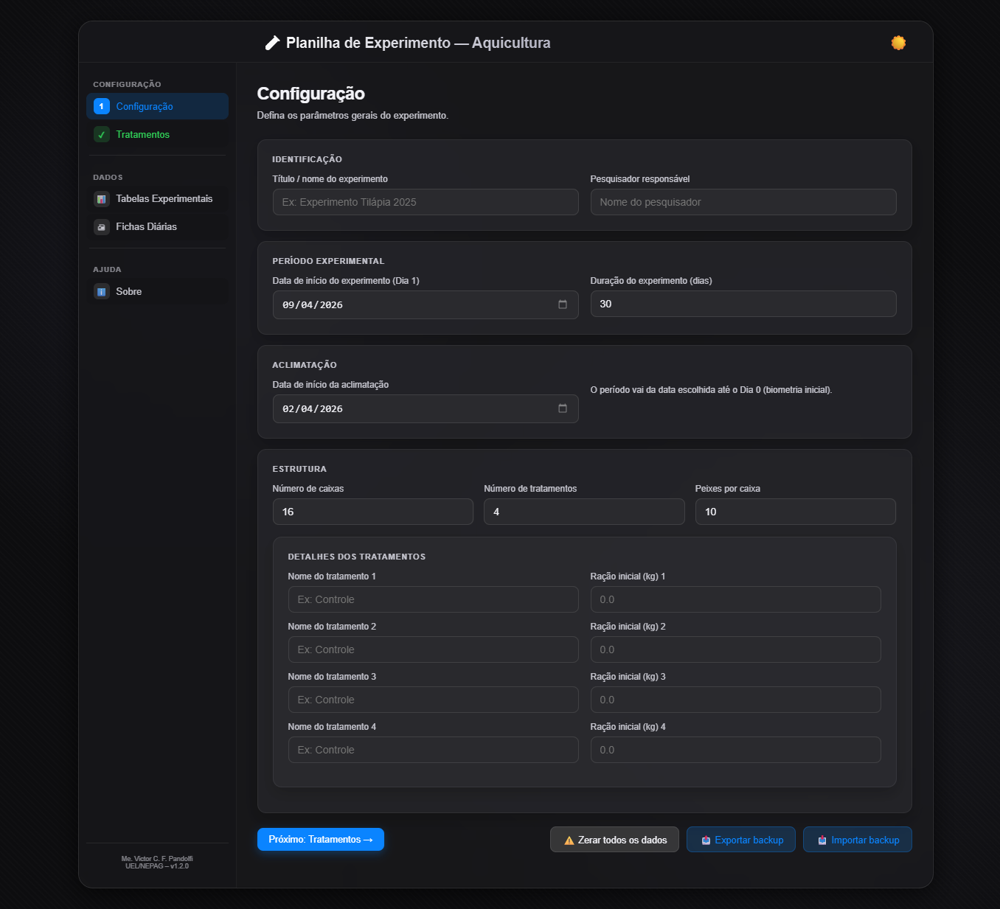

# 🧪 Planilha de Experimento — Aquicultura

**Ferramenta web completa para planejamento, coleta e análise de dados em experimentos aquícolas.**

Desenvolvida como parte do doutorado em Ciência Animal na Universidade Estadual de Londrina (UEL), no âmbito do NEPAG – Núcleo de Estudo em Aquicultura e Genética.

---

## ✨ Funcionalidades

### Aplicativo Web (Planejamento e Coleta)
- **Configuração flexível:** datas, duração, número de caixas, tratamentos e peixes por caixa.
- **Distribuição visual de tratamentos** com nomes personalizáveis.
- **Registro de peso individual dos potes** por caixa.
- **Parâmetros diários:** pH, temperatura, oxigênio dissolvido, condutividade, amônia total, nitrito, mortalidade e manejo alimentar.
- **Cálculo automático** de consumo e ração disponibilizada.
- **Biometrias:** agendamento de biometrias inicial, final e intermediárias com tabela de dados por peixe.
- **Fichas diárias para impressão** em A4 paisagem com capa de resumo.
- **Exportação para Excel** com múltiplas abas e fórmulas prontas para análise.
- **Persistência local:** dados salvos no navegador, sem necessidade de backend.
- **Backup e restauração** de todo o estado do experimento (arquivo JSON).
- **Tema claro/escuro** com efeito vidro fosco (Frosted Glass).

### Dashboard Streamlit (Análise)
- **Leitura automática do Excel** gerado pelo aplicativo web (via OneDrive/Google Drive).
- **Métricas zootécnicas:** peso projetado, conversão alimentar, biomassa, sobrevivência.
- **Alertas de qualidade da água:** NH₃ tóxica (Emerson et al.), nitrito, OD, pH, temperatura.
- **Gráficos interativos** com Plotly.
- **Análise estatística** com correlações e opção de integração com IA (Google Gemini).
- **Exportação de dados filtrados** para CSV/Excel.

---

## 🚀 Acesso Rápido

| Ambiente | Link |
|----------|------|
| **Aplicativo Web** | [https://vcfpand.github.io/Tabelas_Experimentos](https://vcfpand.github.io/Tabelas_Experimentos) |
| **Dashboard Streamlit** | [https://pintado-dashboard.streamlit.app](https://pintado-dashboard.streamlit.app) *(exemplo)* |

---

## 📖 Documentação

- [Guia do Usuário](docs/USER_GUIDE.md) – passo a passo completo.
- [Capturas de Tela](docs/SCREENSHOTS.md) – galeria visual.
- [Detalhes Técnicos](docs/TECHNICAL.md) – arquitetura, estado, exportação Excel.
- [Changelog](CHANGELOG.md) – histórico de versões.
- [Como Contribuir](CONTRIBUTING.md)

---

## 🧬 Como Citar

Se este software foi útil para sua pesquisa, por favor cite:

> PANDOLFI, V. C. F. **Planilha de Experimento** (v1.2.0) [Software]. Universidade Estadual de Londrina, 2026. Disponível em: https://github.com/vcfpand/Tabelas_Experimentos.

Um arquivo [CITATION.cff](CITATION.cff) está disponível para exportação automática.

---

## 👨‍🔬 Desenvolvedor

**Me. Victor César Freitas Pandolfi**  
Doutorando – Programa de Pós-Graduação em Ciência Animal  
Universidade Estadual de Londrina (UEL)  
Membro do NEPAG – Núcleo de Estudo em Aquicultura e Genética  
📧 victor.pandolfi@uel.br  
🔗 [ORCID](https://orcid.org/0000-0000-0000-0000) *(adicione seu ORCID)*

---

## 📜 Licença

Este projeto está licenciado sob a **GNU General Public License v3.0** – veja o arquivo [LICENSE](LICENSE) para detalhes.

---

## 🙏 Agradecimentos

- Ao NEPAG/UEL pelo suporte e infraestrutura.
- Desenvolvido com auxílio de inteligência artificial (DeepSeek e Claude).
- À comunidade open-source pelas bibliotecas utilizadas (SheetJS, Plotly, Streamlit, Pandas).
